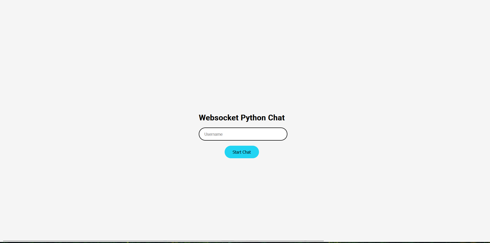

## Small python websocket chat

## Installation

Download source code from github: 

`git clone https://github.com/b1rd-dev/pysocket_chat`

Install requirements from requirements.txt

`pip install -r requirements.txt`

Run

`python main.py`

Go to the browser and open

`127.0.0.1:5000`

 

### Examples:

#### Homepage for login:

#### Chat preview:

